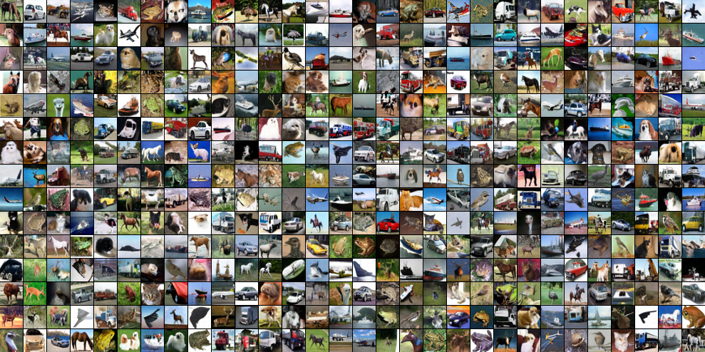
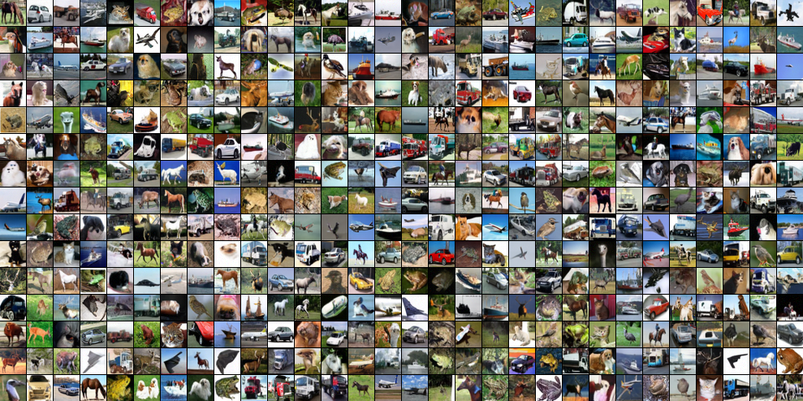

# Stabilizing the Training of Consistency Models with Score Guidance
This project is "Stabilizing the Training of Consistency Models with Score Guidance", motivated the consistency models.

# Dependency installation

The experiments are conducted on the environment of TPU v4-8, mainly. The model architecture and training scheme are implemented with JAX 0.4.20, Flax 0.8.3, and Optax 0.2.2. The dependencies can be changed to adapt for the customized training environments. 

To install the dependencies with the TPU environments, execute the following code:
```
pip install -r requirements_tpu.txt
```

If you want to execute this code with the GPU environment, you can download the dependencies with the `requirements_gpu.txt` as following:

```
pip install -r requirements_gpu.txt
```


# Training

If you want to execute consistency training with score head, use the following bash code: 

```
python main.py --config config
```

If you want to execute vanilla consistency training, use the following bash code: 

```
python main.py --config config_vanilla
```

# Inference

The inference is automatically conducted after training. If you want to conduct inference mode solely, the inferenece mode can be entered with the additional code:

```
python main.py --config config --only_inference
```

# Customized training
If you want to conduct experiments with different settings, you can modify the contents of the configuration files, placed in the `configs` directory.

The configuration files are modulized with the python library, [hydra](https://hydra.cc/), so that you can modify the settings in the yaml files with following the syntax of hydra.

# Results
As the official implementation for iCT is not available at the time of writing, we implemented and trained the model based on the details provided in the iCT paper. Unfortunately, we were unable to reproduce the reported FID scores and instead aimed to improve the sample quality over our reproduction.

Our proposed method achieved FID of 3.37 with one-step generation and FID of 2.79 with two-step generation on the unconditional CIFAR-10 generation task, which outperforms our re-implemented iCT which achieved FID of 3.55 and 2.84 for one-step and two-step generation respectively. As we were not able to reproduce iCT, this falls short of the reported FID scores of 2.83 and 2.46. Nonetheless, we still expect that applying our method to the original iCT implementation will further enhance performance.

Uncurated one step image:


Uncurated two step image:
